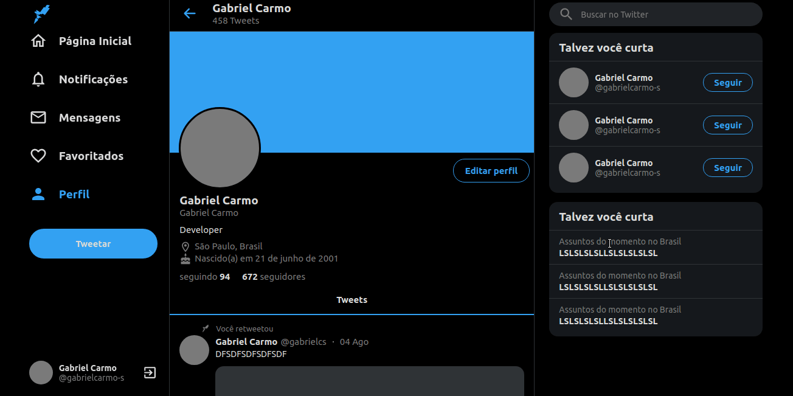
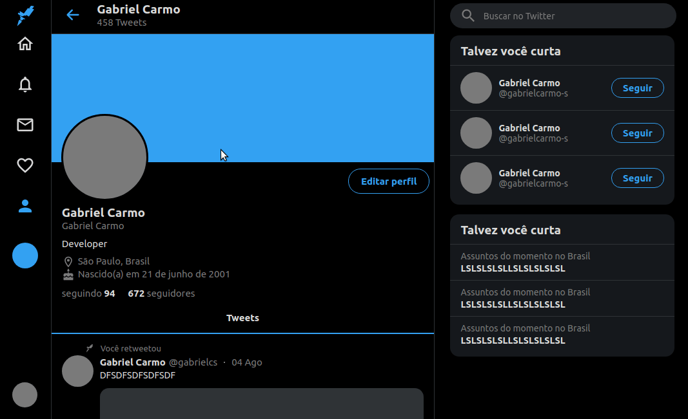
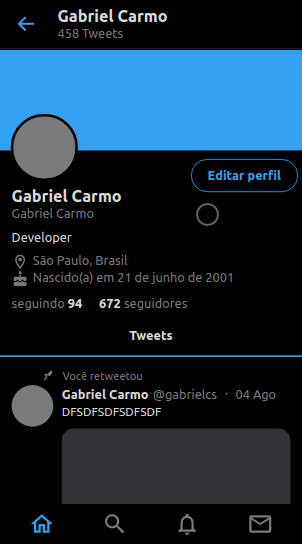

<h1 align="center">
     UI Clone - Responsive Twitter 
        ReactJS
</h1>

  <a href="#bookmark-sobre">Sobre</a>&nbsp;&nbsp;&nbsp;|&nbsp;&nbsp;&nbsp;
  <a href="#rocket-tecnologias">Tecnologias</a>&nbsp;&nbsp;&nbsp;|&nbsp;&nbsp;&nbsp;
  <a href="#boom-como-executar">Como Executar</a>&nbsp;&nbsp;&nbsp;|&nbsp;&nbsp;&nbsp;
  <a href="#memo-licença">Licença</a>

## :bookmark: Sobre

Este projeto é um clone responsivo do Twitter.

  

  

  

## Tela Mobile

  

<a href="https://twitter-clone-gabrielcarmo-s.netlify.app/" align="center">Para testar a interface do Twitter Clone</a>

## :rocket: Tecnologias

-  [Typescript](https://www.typescriptlang.org/)
-  [ReactJS](https://reactjs.org/)

## :boom: Como Executar

- ### **Pré-requisitos**

  - É **necessário** possuir o **[Node.js](https://nodejs.org/en/)** instalado no computador
  - É **necessário** possuir o **[Git](https://git-scm.com/)** instalado e configurado no computador
  - Também, é **preciso** ter um gerenciador de pacotes seja o **[NPM](https://www.npmjs.com/)** ou **[Yarn](https://yarnpkg.com/)**.

## :memo: Licença

Esse projeto está sob a licença MIT. Veja o arquivo [LICENSE](LICENSE.md) para mais detalhes.

---

<h4 align="center"> Feito por Gabriel Carmo </h4>

 
